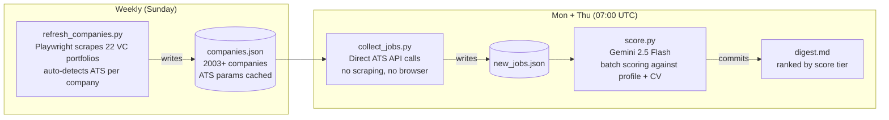

# cyber-jobs-radar

Automated job-search pipeline for senior DS / ML roles in Israeli cyber and fintech.
Scrapes 22 VC portfolio pages, calls ATS APIs directly for 2003+ companies,
scores every open role against a candidate profile via Gemini 2.5 Flash,
and commits a ranked digest to the repo on a cron schedule - fully hands-off
after the weekly refresh.

**Stack:** Python - Playwright - Gemini 2.5 Flash - GitHub Actions - Render

---

## How it works



---

## Scale

| Metric | Count |
|---|---|
| VC portfolios scraped | 22 |
| Companies tracked | 2003 (as of 2026-05-17, grows weekly) |
| ATS integrations | 18 (Comeet, Greenhouse, Lever, Workday, Ashby, SmartRecruiters, Workable, TeamTailor, ...) |

---

## Design decisions

**Direct API calls, not scraping.** `collect_jobs.py` hits ATS REST APIs directly (Comeet, Greenhouse, Lever, Workday, and 14 others). No DOM parsing, no Selenium, no fragile selectors. Most requests complete in under a second.

**LLM only at the scoring edge.** Gemini is called exactly once per job, inside `score.py`. Discovery and collection are fully deterministic - no LLM calls, no token waste in the pipeline.

**Per-adapter, not generic.** Each VC portfolio and ATS has its own adapter file. A single site redesign breaks one file, not the whole pipeline.

**Persistent JSON cache, no database.** `companies.json` accumulates ATS params, failure counts, and verification timestamps for 2003+ companies. No ORM, no migrations, no infrastructure.

---

## Example digest output

```
## Tier 9-10 - Strong fit

### [Hunters] Staff Data Scientist - Detection (score: 9)
Location: Tel Aviv | Source: Glilot Capital (Tier 1) | ATS: Comeet
Apply: https://www.comeet.com/jobs/hunters/...

> Strong match: detection engineering + adversarial ML aligns directly with candidate
> fraud background. Staff-level framing matches target seniority. Israel HQ confirmed.
> Flags: strong-domain-fit
```

---

## Architecture

```
ats/            per-ATS API pullers (comeet.py, greenhouse.py, lever.py, workday.py, ashby.py, smartrecruiters.py, ...)
vcs/            per-VC portfolio scrapers (yl_ventures.py, glilot.py, team8.py, cyberstarts.py, viola.py, ...)
matcher/        Gemini scoring (gemini_scorer.py) - LLM calls live here only
profiles/       per-user config + outputs (profile.md, cv.md, digest.md, scored_jobs.json)
companies.json  persistent cache - ATS params + failure tracking for 2003+ companies
```

---

## Setup

```bash
uv sync
uv run playwright install chromium
cp .env.example .env   # add GEMINI_API_KEY
```

```bash
uv run python refresh_companies.py   # weekly  - VC scrape + ATS detection
uv run python collect_jobs.py        # daily   - hit ATS APIs
uv run python score.py               # on demand - score via Gemini, write digest.md
```

---

## Tests

```bash
uv run python3 -m pytest tests/ -v
uv run python score.py --dry-run     # inspect prompt, no API call
```
