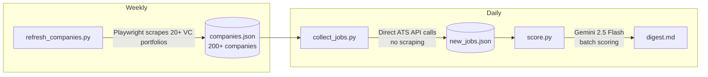

| Field | Value |
|---|---|
| **Phase** | P4 |
| **Status** | `wrapped` |
| **Effort** | S |
| **Epic** | — |
| **Depends on** | — |
| **Blocks** | — |
| **Touches** | `README.md` |

## Overview

The current README is a minimal internal doc. Rewrite it as an engineering showcase that a hiring manager can skim in 90 seconds and understand what's impressive: real-world scale (200+ companies, 15+ ATS integrations), clean architecture, LLM-at-the-edge discipline. This is the repo's landing page and the first thing anyone reviewing Omer's portfolio sees.

## Behaviour

### Structure (in order)

**1. Hero**
```
# cyber-jobs-radar

Automated job-search pipeline for senior DS roles in Israeli cyber & fintech.
Scrapes 20+ VC portfolios, calls 15+ ATS APIs directly, scores every open role
against a candidate profile via Gemini 2.5 Flash, and outputs a ranked digest —
fully hands-off after the weekly refresh.
```
Followed by a one-line tech stack: `Python · Playwright · Gemini 2.5 Flash · GitHub Actions · Render`

**2. Pipeline overview diagram**
ASCII or Mermaid diagram showing the three-script flow. Use a `mermaid` code block (renders on GitHub):



**3. Scale callouts**
Three key numbers, presented as a simple table or bold inline:
- VC portfolios tracked: count `vcs/*.py` files (excluding `__init__.py`, `registry.py`)
- ATS integrations: count `ats/*.py` files (excluding `__init__.py`, `detect.py`, `utils.py`)
- Companies in pipeline: pull live count from `companies.json` using `jq length companies.json` or equivalent — hard-code the number at time of writing with a note "(as of YYYY-MM-DD, grows weekly)"

**4. Design decisions** — 4 bullet points, each 1-2 sentences:
- **Direct API calls, not scraping** — collect_jobs.py hits ATS REST APIs directly (Comeet, Greenhouse, Lever, Workday, Ashby, SmartRecruiters, and 8 others). No fragile DOM parsing; most run in <1s per company.
- **LLM only at the scoring edge** — Gemini is called exactly once per job, in score.py. The discovery and collection layers are fully deterministic; no LLM calls, no token waste.
- **Per-adapter, not generic** — each VC and ATS has its own adapter file. No shared "smart" scraper that would fail across all targets on a single site redesign.
- **Persistent state, no database** — companies.json is a plain JSON cache of 200+ entries, append-only. No ORM, no migrations, no infra to maintain.

**5. Example digest output**
A fenced code block showing a realistic (fabricated-but-plausible) scored job entry:
```
## Tier 9-10 — Strong fit

### [CrowdStrike] Senior Data Scientist — Threat Intelligence (score: 9)
Location: Tel Aviv | Source: Glilot Capital (Tier 1)
Apply: https://jobs.lever.co/crowdstrike/...

> Strong fit: adversarial ML + threat intelligence overlap with candidate's fraud
> detection background. Team Lead framing matches target seniority. Israel HQ confirmed.
> Flag: competitive-market
```

**6. Architecture**
Brief section: what each file/directory does. Keep it tight — 1 line per entry, no prose. Example:
```
ats/            per-ATS API pullers (comeet.py, greenhouse.py, lever.py, ...)
vcs/            per-VC portfolio scrapers (yl_ventures.py, glilot.py, ...)
matcher/        Gemini scoring (gemini_scorer.py) — LLM calls live here only
profiles/       per-user config + output (profile.md, cv.md, digest.md, ...)
companies.json  persistent cache — ATS params + failure tracking for 200+ companies
```

**7. Setup**
```bash
uv sync
uv run playwright install chromium
cp .env.example .env   # add GEMINI_API_KEY
uv run python refresh_companies.py   # weekly
uv run python collect_jobs.py        # daily
uv run python score.py               # on demand
```

**8. Running tests**
```bash
uv run python3 -m pytest tests/ -v
uv run python score.py --dry-run     # prompt inspection, no API call
```

### Tone
- Matter-of-fact, no hype. Let the numbers speak.
- No "I built this" or first-person. Write in third person / imperative.
- No emojis.
- Hyphens, not em-dashes.

## Files to Touch

- `README.md` — full rewrite

## How to QA

1. Read the new README.md — all 8 sections present, no broken markdown.
2. Mermaid diagram renders correctly when pasted into https://mermaid.live/ (or trust the syntax).
3. Scale numbers are accurate (count the actual .py files, use actual companies.json count).
4. `uv run python3 -m pytest tests/ -v` passes.
5. `uv run python score.py --dry-run` passes.
